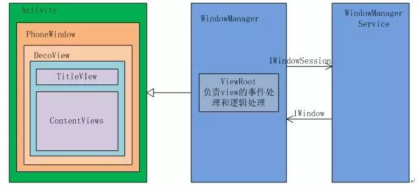

[参考文章1](https://zhuanlan.zhihu.com/p/69830632)
[参考文章2](https://zhuanlan.zhihu.com/p/26834562)
## 三者关系介绍

Activity持有一个window对象
```
public class Activity extends ContextThemeWrappe{
    private Window mWindow;
}
```
但Window是抽象类,有唯一实现类PhoneWindow,也就是Activity持有的是PhoneWindow.PhoneWindow中一个View对象:DecorView
```
public class PhoneWindow extends Window{
  // This is the top-level view of the window, containing the   window decor.
  private DecorView mDecor; 
}
```
而DecorView是继承自FrameLayout
```
public class DecorView extends FrameLayout {
  
}
```
DecorView是视图树的根节点,一般情况相爱内部包含一个竖直方向的LinearLayout,这个LinearLayout中有上中下三个部分,上面是ViewStub,是根据Theme设置的ActionBar.中间是TitleView(根据Theme设置,有的没有).下边是ContentView.

Window在Activity中主要管理view的创建,和ViewRootImpl(对应ViewRoot,连接了WindowManagerService和DecorView),这样设计的好处是Activity与view解耦,不需要关心view操作的细节.

## setContentView()
在Activity中调用了setContentView()
```
Activity: 

@Override
protected void onCreate(Bundle savedInstanceState) {
  super.onCreate(savedInstanceState);
  setContentView(R.layout.activity_main);
}

public void setContentView(@LayoutRes int layoutResID) {
  getWindow().setContentView(layoutResID);
  initWindowDecorActionBar();
}
```
Activity的setContentView方法调用了Window的setContentView方法
```
PhoneWindow: 

@Override    
public void setContentView(int layoutResID) {
  if (mContentParent == null) {
    //初始化 id 为 android.R.id.content 的根布局，将其赋值给 mContentParent
    installDecor();
  } else {
    mContentParent.removeAllViews();
  }

  //把 Activity 中指定的布局 id 最终 inflate 到 mContentParent 中
  mLayoutInflater.inflate(layoutResID, mContentParent);

  final Callback cb = getCallback();
  if (cb != null && !isDestroyed()) {
    cb.onContentChanged();
  }
}
```
mContentParent是DecorView中的ContentView,是一个FrameLayout.在installDecor()中初始化了decorView.
```
private void installDecor() {
    if (mDecor == null) {
        mDecor = generateDecor(); //生成DecorView
        mDecor.setDescendantFocusability(ViewGroup.FOCUS_AFTER_DESCENDANTS);
        mDecor.setIsRootNamespace(true);
        if (!mInvalidatePanelMenuPosted && mInvalidatePanelMenuFeatures != 0) {
            mDecor.postOnAnimation(mInvalidatePanelMenuRunnable);
        }
    }
    if (mContentParent == null) {
        mContentParent = generateLayout(mDecor); // 为DecorView设置布局格式，并返回mContentParent
        ...
        } 
    }
}
```
先看generateDecor()
```
protected DecorView generateDecor() {
        return new DecorView(getContext(), -1);
    }
```
new了一个decorview,然后是generateLayout()
```
protected ViewGroup generateLayout(DecorView decor) {
        // 从主题文件中获取样式信息
        TypedArray a = getWindowStyle();
        ...................
        if (a.getBoolean(R.styleable.Window_windowNoTitle, false)) {
            requestFeature(FEATURE_NO_TITLE);
        } else if (a.getBoolean(R.styleable.Window_windowActionBar, false)) {
            // Don't allow an action bar if there is no title.
            requestFeature(FEATURE_ACTION_BAR);
        }
     ................
        // 根据主题样式，加载窗口布局
        int layoutResource;
        int features = getLocalFeatures();
        // System.out.println("Features: 0x" + Integer.toHexString(features));
        if ((features & (1 << FEATURE_SWIPE_TO_DISMISS)) != 0) {
            layoutResource = R.layout.screen_swipe_dismiss;
        } else if(...){
            ...
        }

        View in = mLayoutInflater.inflate(layoutResource, null);    //加载layoutResource

       //往DecorView中添加子View，即文章开头介绍DecorView时提到的布局格式，那只是一个例子，根据主题样式不同，加载不同的布局。
        decor.addView(in, new ViewGroup.LayoutParams(MATCH_PARENT, MATCH_PARENT)); 
        mContentRoot = (ViewGroup) in;

        ViewGroup contentParent = (ViewGroup)findViewById(ID_ANDROID_CONTENT); // 这里获取的就是mContentParent
        if (contentParent == null) {
            throw new RuntimeException("Window couldn't find content container view");
        }
        ...

        return contentParent;
    }
```
获取主题样式,然后加载布局到DecorView中,然后找到contentView返回给mContentParent