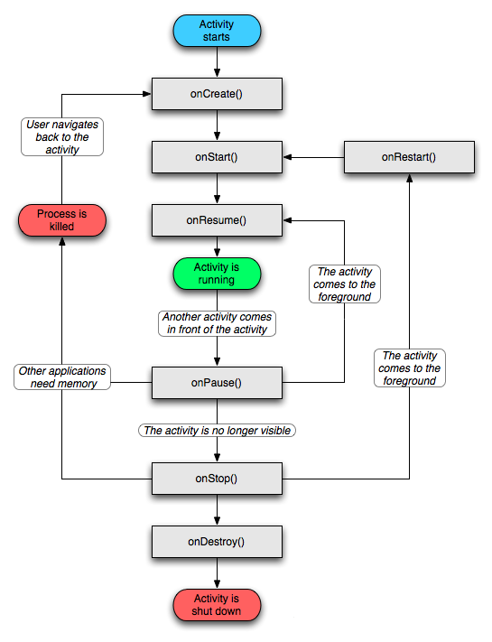
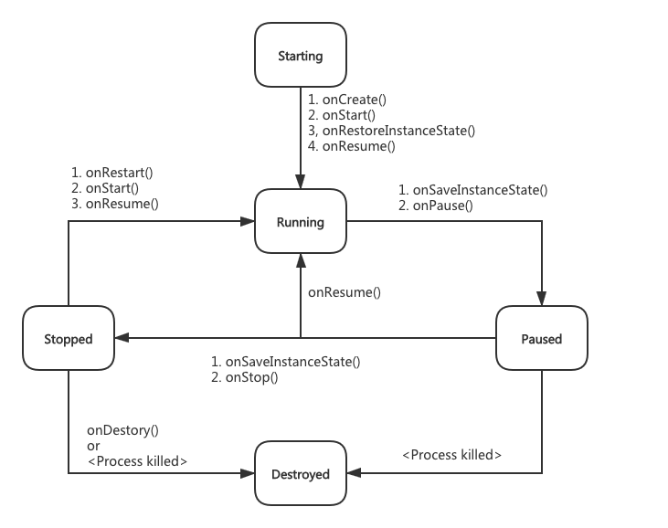
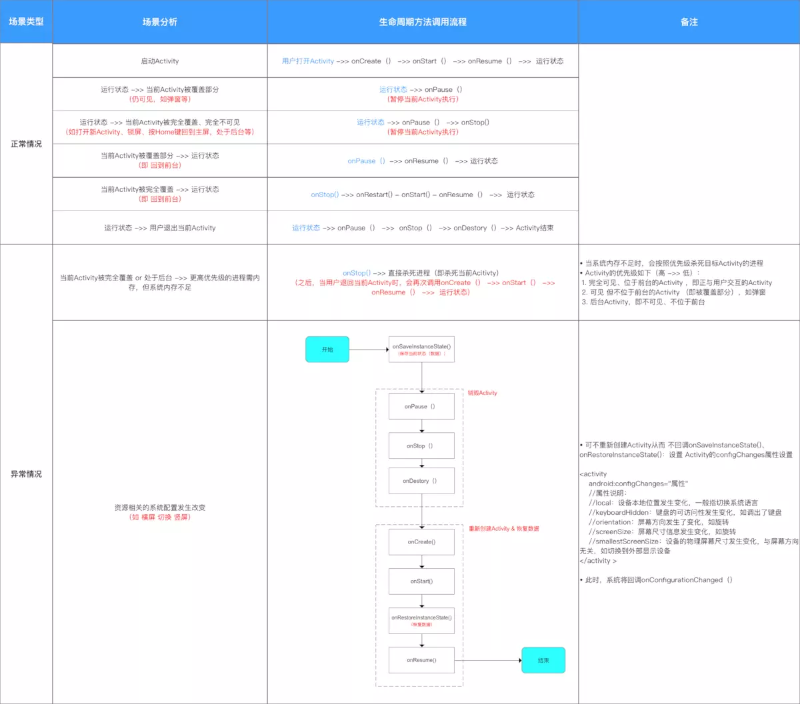

## 一些说明
### 四个状态
1. running:当前显示在屏幕的Activity(位于task栈顶),用户可见状态.
2. paused:依旧在用户可见状态(包括部分可见),但是失去焦点,用户无法交互
3. stopped:用户不可见,也无法交互,被完全覆盖.
4. killed:被销毁,等待回收.
### 生命周期的一些解释
1. onCreate():这个方法会初始化当前布局,调用setContentLayout方法.
2. onStart():当前Activity是用户可见状态,但是没有焦点,不能交互,一般这时候可以做一些初始化.
3. onResume():当前Activity进入running状态,可以交互.
4. onPause():当另外一个Activity覆盖当前Activity时,当前Activity进去这个方法,用户可见但是不可交互.
5. onStop():此时Activity用户不可见,在系统内存紧张时可能被回收,这里可以做一些资源回收.
6. onRestart():APP退出到后台再返回的时候调用.

### Activity1切换到Activity2时:
1. Activity1:onPause()
2. Activity2:onCreate()->onStart()->onResume()
3. Activity1:onStop()->onDestory()

### 常见场景的生命周期
