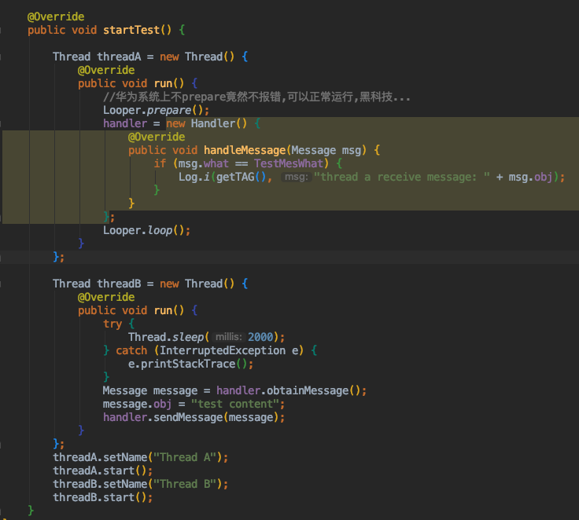
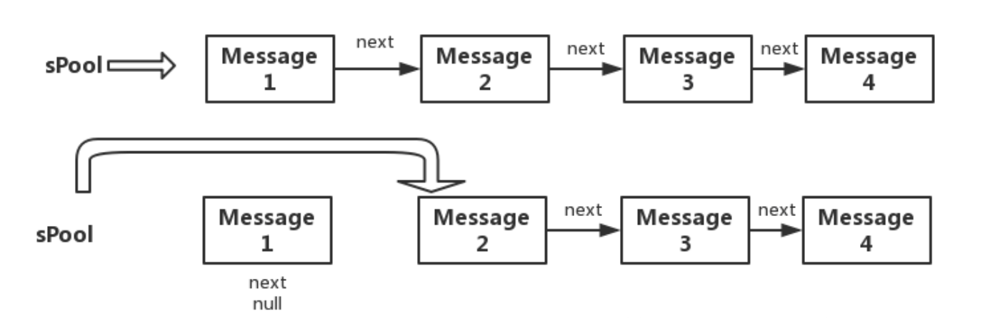

作用:跨线程通信
创建handler前要Looper.prepare
发送消息最后调用的是MessageQueue的enqueueMessage方法
接受消息要调用Loop.loop
Handler用obtain获得message,因而为有个spool缓存池,比new message好.

# Handler
handler用来在线程间通信的.



## 创建Handler
不能直接创建Handler,要先Looper.prepare.直接创建会报错 `not called Looper.prepare()`.<br>
创建Handler:

```
public Handler(Callback callback, boolean async) {
    ...

    mLooper = Looper.myLooper();
    if (mLooper == null) {
        throw new RuntimeException(
            "Can't create handler inside thread that has not called Looper.prepare()");
    }
    mQueue = mLooper.mQueue;
    mCallback = callback;
    mAsynchronous = async;
}

//Looper.myLooper返回了mLooper

public static @Nullable Looper myLooper() {
    return sThreadLocal.get();
}   

//通过sThreadLocal获得的,这个初始化就是在Loop.prepare

public static void prepare() {
    prepare(true);
}

private static void prepare(boolean quitAllowed) {
    if (sThreadLocal.get() != null) {
        throw new RuntimeException("Only one Looper may be created per thread");
    }
    sThreadLocal.set(new Looper(quitAllowed));
}
```

主线程不需要prepare,是因为:

```
//ActivityMain的main方法,已经初始化了Looper
public static void main(String[] args) {
    ...
    Looper.prepareMainLooper();
    ...
}
```
## 发送消息
调用的是handler.sendMessage(),看源码都会走到这里:

```
public boolean sendMessageAtTime(Message msg, long uptimeMillis) {
    MessageQueue queue = mQueue;
    if (queue == null) {
        RuntimeException e = new RuntimeException(
                this + " sendMessageAtTime() called with no mQueue");
        Log.w("Looper", e.getMessage(), e);
        return false;
    }
    return enqueueMessage(queue, msg, uptimeMillis);
}
```
enqueueMessage内部调用的是MessageQueue的enqueueMessage,把mes添加进来,这里边根据Message.next形成了一个链表.

## 接受消息
主要是用了Loop.loop方法.看源码是循环取MessageQueue里的message,然后通过message.target.dispatchMessage分发消息,这个target就是handler.

```
public void dispatchMessage(Message msg) {
    if (msg.callback != null) {
        handleCallback(msg);
    } else {
        if (mCallback != null) {
            if (mCallback.handleMessage(msg)) {
                return;
            }
        }
        handleMessage(msg);
    }
}
```
如果msg有callback(Runnable对象),就是调用这个runnable的run.

```
private static void handleCallback(Message message) {
    message.callback.run();
}
```
msg没有callback的话,如果handler创建的时候有callback(Handler的一个接口),就调用这个接口的handle方法.<br>
这个callback也没有的话,就调用创建handler实现的handleMessage方法.

## 创建消息
创建消息的时候用的handler.obtainMessage而不是new一个,是因为Message里边有个缓存池.<br>
obtainMessage最终会走到Message的obtain方法.

```
/**
    * Return a new Message instance from the global pool. Allows us to
    * avoid allocating new objects in many cases.
    */
public static Message obtain() {
    synchronized (sPoolSync) {
        if (sPool != null) {
            Message m = sPool;
            sPool = m.next;
            m.next = null;
            m.flags = 0; // clear in-use flag
            sPoolSize--;
            return m;
        }
    }
    return new Message();
}
```


## Handler的内存泄漏问题
在Activity中直接new Handler的话,handler为一个内部类,隐式引用了Activity,会导致Handler在执行而不能回收Activity,造成泄漏.<br>
解决办法就是静态内部类+弱引用

```
private static class MyHandler extends  Handler{
    private final WeakReference<MainActivity> mActicity;
    public MyHandler(MainActivity activity){
        mActicity = new WeakReference<MainActivity>(activity);
    }
    @Override
    public void handleMessage(Message mes){
        ...
    }
}
```


