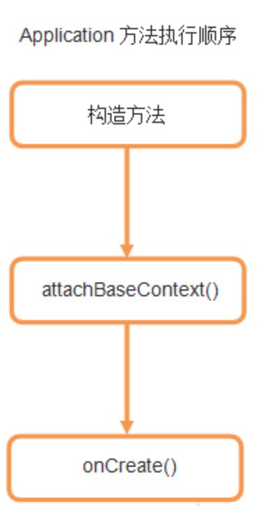

# Context
## context继承结构

application,service和activity都是context的子类,但是四大组件里的Content Provider和Broadcast Receiver并不是,不过内部持有一个传进来的Context.
## ContextWrapper与ContextImpl
ContextWrapper就是ContextImpl的包装,getAssest(),getMainLooper()等等context的操作都是交由内部持有的ContextImpl实现的,通过attachBaseContext()这个方法给内部的context赋值.
## Application与Context
Application是ContextWrapper的子类,但是调用Context的方法时要注意,attachBaseContext()这个方法是在构造方法之后,onCreate之前调用的,所以要在onCreate之后调用Context的方法.

getApplication()与getApplicationContext()其实返回的都是一个东西,不过含义不同,而且getApplication()在Activity和Service中才能调用,getApplicationContext()的作用域更广一些.但是getBaseContext()就不一样了,获取的是ContextWrapper的ContextImpl对象.
## Context作用域

Activity的context作用域最广,毕竟是继承自ContextThemeWrapper. 
*  用Application或Service启动一个Activity是可行的,但是要为目标Activity标记FLAG_ACTIVITY_NEW_TASK,一般不这么用.
* 在Application或Service去inflate一个布局是可以的,但是会使用系统默认的主题样式,用不了自定义的,所以也不推荐.
## 如何获取Context
1. View.getContext,返回当前View对象的Context,一般就是当前的Activity.
2. Activity.getApplicationContext,全局的Application context.
3. ContextWrapper.getBaseContext,用的不多.
4. Activity.this,就是Activity的context.
## Context与内存泄漏
### Context与单例
一个单例的对象会保存一个静态的Instance,要是这个Instance持有了context,这个context还是Activity的话,由于Instance的生命周期长于Activity,就会造成Activity内存泄漏. 
在单例里最好用Application context.
### View持有Activity
Activity里边有一个static的view的话,view一般会持有Activity的context,static的view就会造成内存泄漏.
