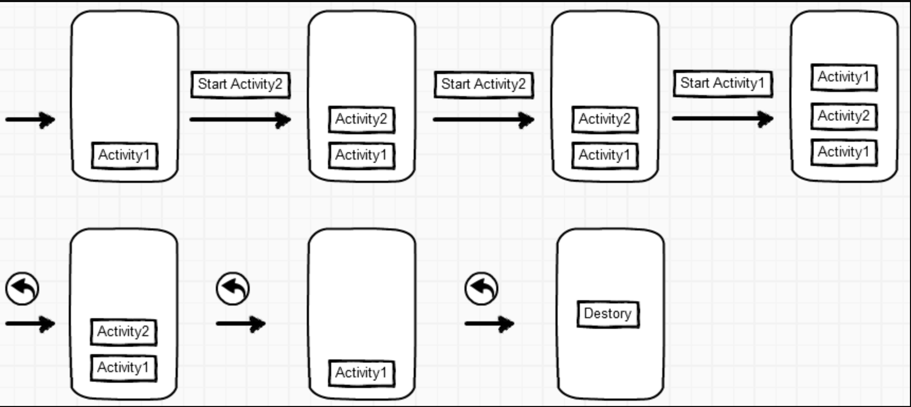
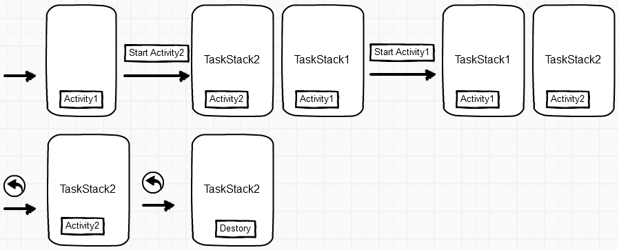
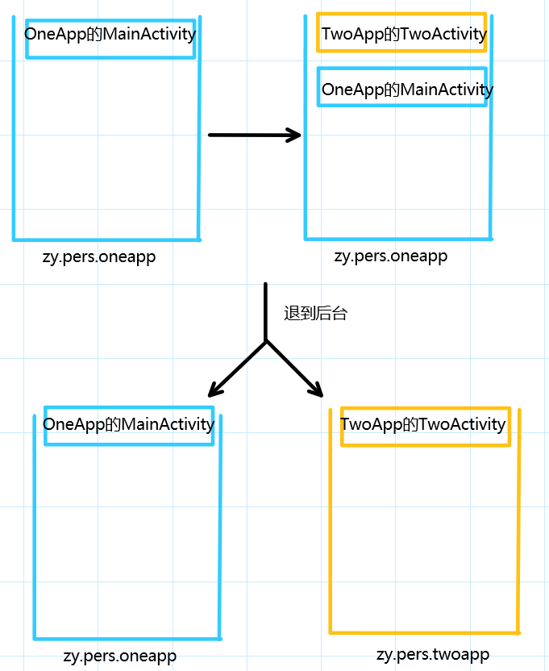

# 四种启动模式
## 一些基础
1. Activity都有一个对应的action,action可以用来隐式启动,在manifest中配置.
2.  任务栈(Task Stack),也叫回退栈(Back Stack),放Activity的. 
    * 在任务栈中,不在栈顶的Activity是onStop状态.
    * taskId是Integer自增长型.
    * task最后一个Activity被销毁时,对应的APP被关闭,清除task栈,但是还会保留APP的进程,再次进入会创建新的task栈.
3. Activity的affinity
    * affinity是Activity内的一个属性,manifest中对应属性为taskAffinity.默认情况下,拥有相同affinity的Activity在一个task栈中.
    * Task也有affinity属性,由根Activity(创建task栈时第一个入栈的Activity)决定.
    * 默认情况下,所有Activity的affinity属性从application继承.
    * application默认的affinity属性为manifest的包名.
## 启动模式
### 1 默认启动模式standard

每启动一个Activity就按顺序入栈.
### 2 栈顶复用模式singleTop

新启动的Activity在栈顶的话就不用重复创建,其他就创建入栈
### 3 栈内复用模式singleTask

新启动的Activity在栈内有实例的话,就把对应的Activity之前的所有Activity出栈.
### 4 全局唯一模式singleInstance

新启动的Activity放在新的task栈中.如果已经创建过要启动的Activity,则不会重复创建task栈,而是唤醒之前的Activity(对应task栈设为foreground状态).
## 设置启动模式
### 静态设置
在manifest中通过launchMode属性设置
#### 动态设置
设置Intent的Flag,```intent.setFlag()```这个方法.同时有静态和动态设置的时候,动态设置的优先级高.

几种常见的flag:
1. Intent.FLAG_ACTIVITY_NEW_TASK

    与singleInstance类似,根据目标Activity的affinity判断需不需要创建新的task,如果存在与其affinity相同的task,就把目标Activity入栈,没有就新建一个task入栈.

    与singleInstance不同的地方:
    * 新的task并没有说只能存在一个Activity,singleInstance中新的task只能放一个Activity.
    * 在同一application中,如果Activity都是默认的affinity,那么都是相同的,这个flag就不起作用,但是singleInstance默认情况下也会创建新的task.
2. Intent.FLAG_ACTIVITY_SINGLE_TOP

    和上边singleTop效果相同.
3. Intent.FLAG_ACTIVITY_CLEAR_TOP
    
    目标Activity会检查task中是否存在此实例,没有就创建入栈,有的话就把对应Activity之前的Activity出栈,这时分两种情况:
    * 如果同时设置FLAG_ACTIVITY_SINGLE_TOP,就直接使用栈内的对应Activity.
    * 没有设置要把栈内对应的Activity销毁重新创建.

    所以同时这时FLAG_ACTIVITY_SINGLE_TOP和FLAG_ACTIVITY_CLEAR_TOP效果就是singleTask模式.

## Manifest中设置task属性
在manifest的Activity标签里边也可以设置task属性
### allowTaskReparenting
为true时当前应用在退到后台时,被标记的Activity从启动的task中移动到相同affinity的task(需要和taskaffinity属性配合使用)



### alwaysRestainTaskState
这个属性只针对根Activity有效,为true的话task被清理时会保留根Activity的状态

### clearTaskOnLaunch
只对根Activity有效.为true时每次唤醒APP会清楚根Activity以外的其他Activity.

例如APP内根Activity为Activity1,设置为true,APP内跳转Activity1->Activity2->Activity3,回到桌面然后重新唤醒APP到前台,显示的是Activity1,2和3被destroy.

### finishOnTaskLaunch
和上边的属性类似,不过是销毁被标记的Activity而不是除根Activity外的Activity.

### noHistory
标记的Activity(包括根Activity)跳转到其他Activity时,task不将其入栈.
例如Activity1标记为true,跳转到Activity2,这时候点击back不会退回到Activity1而是退回到桌面,Activity1也没有onDestroy,因为Activity1没有入栈.
    