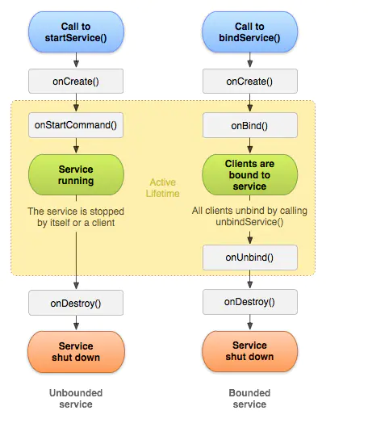

# Service
[参考文章1](https://www.jianshu.com/p/d963c55c3ab9)<br>
[参考文章2](https://blog.csdn.net/guolin_blog/article/details/11952435)<br>
## 一. service作用
Service是Android中实现程序后台运行的解决方案,service只能在后台运行,可以和其他组件交互.
## 二. 开启销毁Service
有启动服务(start service)和绑定服务(bind service)两种方式开启Service.



### start service
写一个类继承Service,要重写onBind方法,这个是给bind service使用的,所以返回null就行.主要重写onStartCommand方法.<br>
在manifest中注册这个service
```
<service android:name=".serviceTest.MyService" />
```
在Activity中开启这个service
```
val startIntent = Intent(context, MyService::class.java)
context.startService(startIntent)
```
停止service
```
val stopIntent = Intent(context, MyService::class.java)
context.stopService(stopIntent)
```
start service后,service附属的Activity即使退出,也不会stop service.

### bind service
写一个类继承Service,在manifest中注册.Activity中是通过ServiceConnection和Binder.
```
override fun onBind(intent: Intent?): IBinder? {
        tcv(tag,"my service bind")
        return mBinder
    }
    
inner class MyBinder :Binder(){
        fun serviceConnectActivity(){
            tcv(tag,"execute service function in activity")
        }
    }
```
binder中的public方法就是Activity中能调用到的方法.Activity中用ServiceConnection来调用binder的方法.
```
private val serviceConnection = object : ServiceConnection {
    override fun onServiceDisconnected(name: ComponentName?) {

    }

    override fun onServiceConnected(name: ComponentName?, service: IBinder?) {
        mBinder = service as? MyService.MyBinder
        mBinder?.serviceConnectActivity()
    }
}
```
Activity中bind service,BIND_AUTO_CREATE表示Activity与service绑定后自动创建service,就会执行service的oncreate而不执行onStartCommand
```
val bindIntent = Intent(context, MyService::class.java)
context.bindService(bindIntent, serviceConnection, Context.BIND_AUTO_CREATE)
```
Activity中取消绑定
```
context.unbindService(serviceConnection)
````
bind service后,Activity退出也会解除service绑定,销毁service.

### service开启子线程
Android的后台指不依赖UI运行,不是另外一个线程.所以本地service和Activity在一个进程内,Activity被销毁,只要进程还在,service就继续运行,直到stop或者unbind,所以service中耗时操作也会ANR,需要service在startCommand或者binder中开启子线程.

### start和bind注意
* service在已经unbind后再调用unbind会抛出异常.一般用个bool判断是否已经unbind.
* 先startService然后bindService,这时unbind不会Destroy service,调用stopService才会Destroy.start service优先级高


## 三. 前台服务 后台服务
后台服务就是只运行在后台,前台服务可以在通知栏看到通知.前台服务优先级比后台高,service不容易被回收.
```
val notificationIntent = Intent(this,MainActivity::class.java)
val pendingIntent = PendingIntent.getActivity(this,0,notificationIntent,0)

val builder = Notification.Builder(this).apply {
    setContentTitle("foreground service title")
    setContentText("foreground service text")
    setSmallIcon(R.drawable.good)
    setContentIntent(pendingIntent)
}
startForeground(1,builder.build())
```

## 四. 本地服务 远程服务
本地服务与调用的Activity在一个进程内,远程服务就在另一个进程中.使用远程service在manifest注册的时候加个process属性,表明这个service会运行在"service"进程中.
```
<service android:name=".serviceTest.MyRemoteService"
        android:process=":service"/>
```
远程service不能用本地service中的bind方式,Activity与service不在一个进程中,要用AIDL来跨进程通信(IPC)